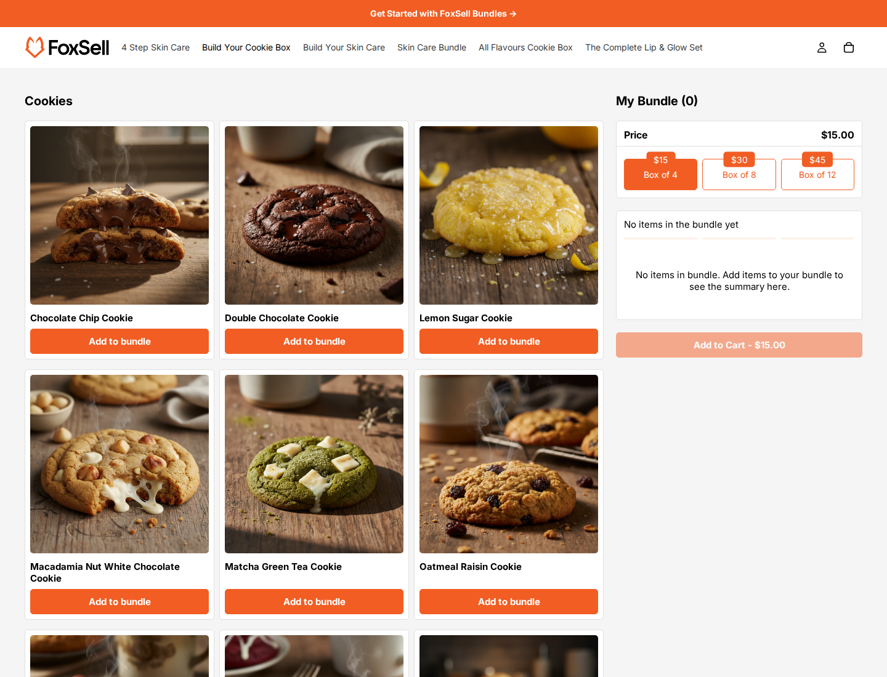

# FoxSell Glow Template

Glow is a ready-to-use FoxSell bundle template for freelancers, developers, and agencies building Shopify bundle experiences for clients. It ships with the Liquid, CSS, and JavaScript needed for a tiered build-your-own-box flow, so you can install it into a theme and customize the merchant-facing settings instead of building a FoxSell-compatible storefront UI from scratch.

## Demo

Demo store: [Build Your Own Cookie Box](https://tools.foxsell.app/tools/fox-demo-delight/store?app=foxsell-bundles-plus&path=/products/build-your-own-cookie-box)

## Files

| Directory | Files | Purpose |
| --- | --- | --- |
| `assets/` | `foxsell-glow.css`, `foxsell-glow.js` | Styling and bundle interaction behavior. |
| `sections/` | `foxsell-glow-mix-match.liquid`, `foxsell-glow-product-modal.liquid` | Main bundle section and product modal section. |
| `snippets/` | `foxsell-glow-*.liquid` | Product cards, options, bundle summary, CSS variables, overrides, and main bundle rendering. |
| `templates/` | `product.foxsell-glow.json` | Product template that places the Glow bundle section on a product page. |

## Features

- FoxSell-compatible dynamic add-ons bundle rendering from the selected bundle product.
- Tiered price cards for fixed-price or quantity-based bundle offers.
- Product cards with variant selectors, swatch support, and a product details modal.
- Bundle summary with configurable labels, add-to-cart text, and progress messaging.
- Theme Editor settings for colors, spacing, radius, product grid, and locale text.

## Installation

1. Copy the files from each directory into the matching Shopify theme directory.
2. Assign `product.foxsell-glow.json` to the FoxSell bundle product, or add the `FoxSell Glow` section manually in the Theme Editor.
3. Select the bundle product in the `Bundle product` setting.
4. Configure styling, product card behavior, progress messages, and locale text from the section settings.

## Notes

- The section renders only when the selected product has FoxSell dynamic add-ons bundle configuration.
- Use this template when a client needs a polished, pre-built bundle page with broad Theme Editor controls.
