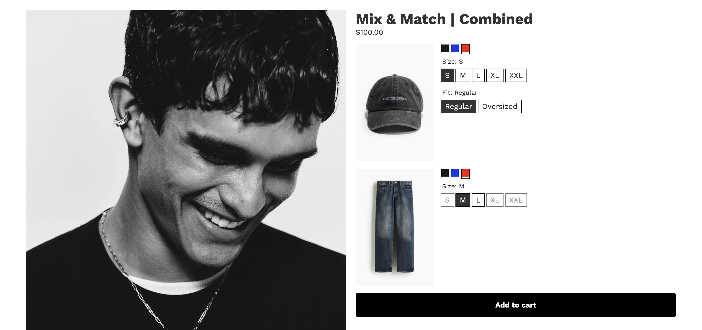

# Mix Match Combined Listing Bundle Template

The Mix Match Combined Listing template is a fixed-price bundle layout for products where each option, such as color, is represented by a separate Shopify product. It combines products from a category into a unified listing so customers can select between multiple products in the same category.

## Files

| Directory | Files | Purpose |
| --- | --- | --- |
| `assets/` | `foxsell.css`, `foxsell.js`, image | Styling, bundle interaction behavior, and README screenshot. |
| `sections/` | `foxsell-shadow-product-card.liquid` | Main combined listing section. |
| `snippets/` | `foxsell-mix-match-combined.liquid`, `foxsell-product-options.liquid` | Combined category rendering and variant options. |

## Features

- Combined listing of products from each category.
- Multiple products per category.
- Native Shopify swatch support.
- Image updates on variant change.
- Useful for fashion and apparel catalogs where variants are modeled as products.

## Supported Configuration

| Feature | Supported |
| --- | --- |
| Quantity as option | No |
| Pricing type | Fixed pricing only |
| Add-ons | No |
| Products per category | Multiple |

## Installation

1. Copy the files from each directory into the matching Shopify theme directory.
2. Add the combined listing section in the Shopify Theme Editor.
3. Configure each bundle category with the products that should appear together.
4. Adjust swatch or color metafield behavior in the snippets if the theme uses a custom option model.

## Future Scope

- Dynamic bundle support.
- Add-on support.
- Quantity selection support.
