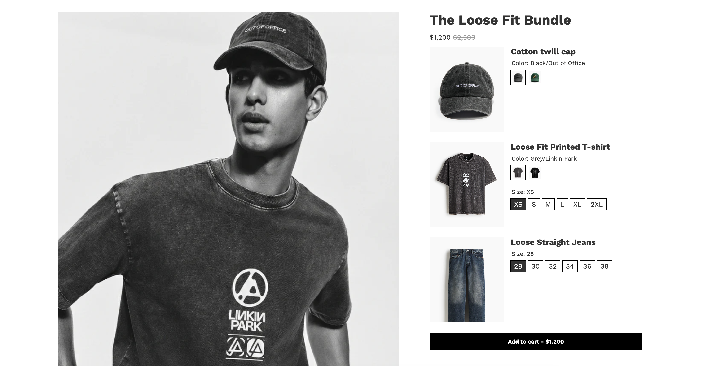
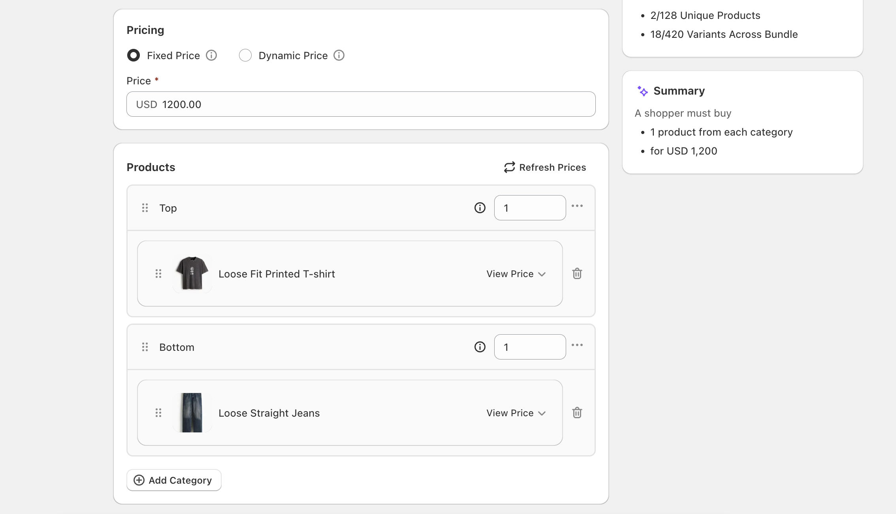

# Mix Match Fixed Bundle Template

The Mix Match Fixed template is a fixed-price bundle layout for stores that need one product per category with variant selection. It shows product cards, variant options, native Shopify swatches, and quick product image previews.

## Files

| Directory | Files | Purpose |
| --- | --- | --- |
| `assets/` | `foxsell.css`, `foxsell.js`, `foxsell-product-card.css`, images | Styling, bundle interaction behavior, and README screenshots. |
| `sections/` | `foxsell-mix-match.liquid` | Main bundle section. |
| `snippets/` | `foxsell-mix-match.liquid`, `foxsell-product-card.liquid`, `foxsell-product-options.liquid` | Bundle category rendering, product cards, and variant options. |

## Features

- Fixed-price mix-and-match bundle layout.
- One product per category.
- Product cards with variant selection.
- Native Shopify swatch support.
- Quick peek product images.

## Supported Configuration

| Feature | Supported |
| --- | --- |
| Quantity as option | No |
| Pricing type | Fixed pricing only |
| Add-ons | No |
| Products per category | One |

## Installation

1. Copy the files from each directory into the matching Shopify theme directory.
2. Add the `FoxSell Mix Match` section in the Shopify Theme Editor.
3. Configure the section settings, including category title visibility.
4. Confirm the bundle categories each contain one product.

## Future Scope

- Dynamic bundle support.
- Add-on support.
