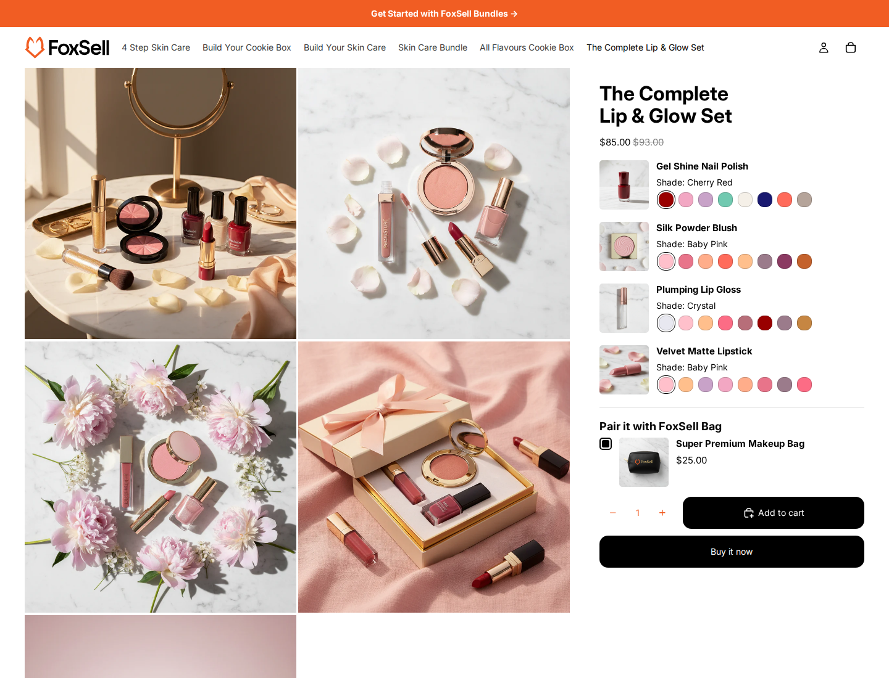

# FoxSell Shade Template

Shade is a ready-to-use FoxSell bundle template for freelancers, developers, and agencies building PDP-first bundle experiences for Shopify clients. It ships as a theme app block, making it a good fit when the bundle UI needs to sit inside an existing product page instead of using a separate product JSON template.

## Demo

Demo store: [The Complete Lip & Glow Set](https://tools.foxsell.app/tools/fox-demo-delight/store?app=foxsell-bundles-plus&path=/products/the-complete-lip-glow-set)

## Files

| Directory | Files | Purpose |
| --- | --- | --- |
| `assets/` | `foxsell-shade.css`, `foxsell-shade.js` | Styling and bundle interaction behavior. |
| `blocks/` | `foxsell-shade.liquid` | Theme app block used to place the bundle in the Theme Editor. |
| `sections/` | `foxsell-shade-product-modal.liquid` | Product modal section. |
| `snippets/` | `foxsell-shade-*.liquid` | Product cards, options, CSS variables, overrides, and main bundle rendering. |

## Features

- App block placement for product pages.
- FoxSell-compatible dynamic add-ons bundle rendering from the current product or selected bundle product.
- Variant-heavy fixed-set bundle UI for cosmetics, beauty, and similar curated product sets.
- Configurable product cards, variant style, swatches, colors, radius, and button text.
- Product modal for item details.
- Works without adding a dedicated product JSON template.

## Installation

1. Copy the files from each directory into the matching Shopify theme directory.
2. Add the `FoxSell Shade` block to the product page in the Shopify Theme Editor.
3. Optionally select a bundle product in the block settings. If left blank, the block uses the current product.
4. Configure product card settings, colors, spacing, and locale text from the block settings.

## Notes

- The block renders only when the resolved product has FoxSell dynamic add-ons bundle configuration.
- Use this template when a client needs a pre-built FoxSell bundle block embedded in an existing product page layout.
