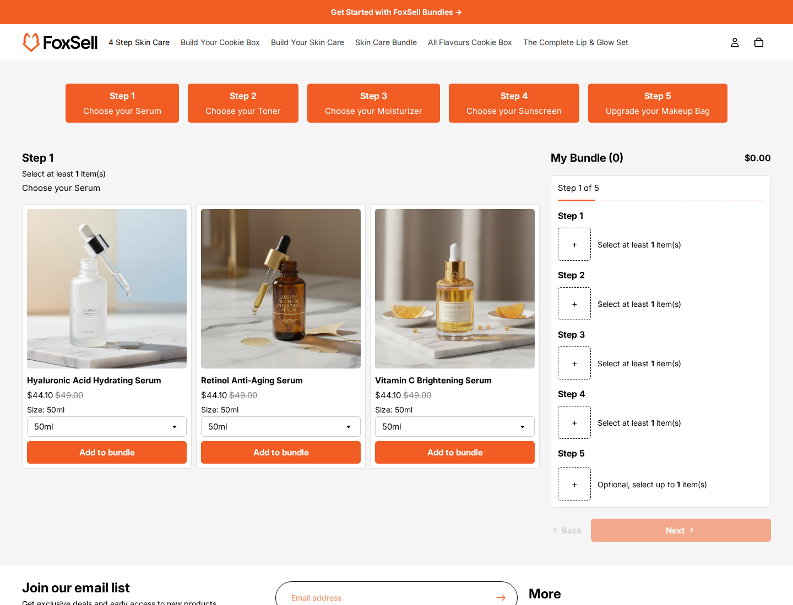

# FoxSell Step Template

Step is a ready-to-use FoxSell bundle template for freelancers, developers, and agencies building guided bundle flows for Shopify clients. It provides the Liquid, CSS, and JavaScript for a multi-step build-your-own-box experience, including quantity rules and summary messaging that work with FoxSell bundle configuration out of the box.

## Demo

Demo store: [4 Step Skin Care Bundle](https://tools.foxsell.app/tools/fox-demo-delight/store?app=foxsell-bundles-plus&path=/products/4-step-skin-care-bundle)

## Files

| Directory | Files | Purpose |
| --- | --- | --- |
| `assets/` | `foxsell-step.css`, `foxsell-step.js` | Styling and bundle interaction behavior. |
| `sections/` | `foxsell-step-mix-match.liquid`, `foxsell-step-product-modal.liquid` | Main bundle section and product modal section. |
| `snippets/` | `foxsell-step-*.liquid` | Product cards, options, quantity rules, bundle summary, CSS variables, overrides, and main bundle rendering. |
| `templates/` | `product.foxsell-step.json` | Product template that places the Step bundle section on a product page. |

## Features

- FoxSell-compatible dynamic add-ons bundle rendering from the selected bundle product.
- Guided step navigation for client bundles with clear shopper tasks.
- Quantity rule snippet for step-based bundle requirements.
- Progress messages for incomplete, complete, and over-limit states.
- Configurable product grid, product cards, colors, button text, and product modal.

## Installation

1. Copy the files from each directory into the matching Shopify theme directory.
2. Assign `product.foxsell-step.json` to the FoxSell bundle product, or add the `FoxSell Step` section manually in the Theme Editor.
3. Select the bundle product in the `Bundle product` setting.
4. Configure quantity messaging, product grid settings, colors, and locale text from the section settings.

## Notes

- The section renders only when the selected product has FoxSell dynamic add-ons bundle configuration.
- Use this template when a client needs a pre-built guided purchase path with visible quantity requirements and completion states.
